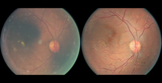
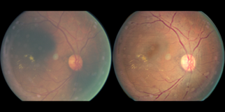
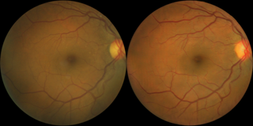

No-Reference Retinal Image Quality Visual Assessment Metric Protocol.
==========================
This is an evaluation criterion for unsupervised retinal image noise reduction tasks. Due to the lack of pairs of clean and noisy images, we formulate a metric for evaluating No-reference quality.
The main assessment indicators come from three points: (1) Lesion structure; (2) Background Color; (3) Generating extra Structure.

## 1. Lesion Structure
In the denoise task, it is easy for the generative model to ignore the lesion structure. The denoised images lesion and the original images do not match. The main assessment method is the consistency of lesion structure and loss of lesion information.
              -      Lesion structure changed after denoised  

      

  

  

