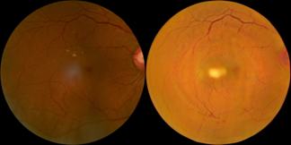
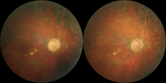

No-Reference Retinal Image Quality Visual Assessment Metric Protocol.
==========================
This is an evaluation criterion for unsupervised retinal image noise reduction tasks. Due to the lack of pairs of clean and noisy images, we formulate a metric for evaluating No-reference quality.
The main assessment indicators come from three points: (1) Lesion structure; (2) Background Color; (3) Generating extra Structure.

## (1). Lesion Structure
In the denoise task, it is easy for the generative model to ignore the lesion structure. The denoised images lesion and the original images do not match. The main assessment method is the consistency of lesion structure and loss of lesion information.

### Lesion structure changed after denoised
 

### Keep the lesion structure
 

### Lesion structure loss
 

## (2).	Background Color 
We consider that many retinopathies are related to the background color, So the denoise images need to keep the main color does not have a big change.

### Background color changed after Denoise
 

### Background color does not have big changes after Denoise
 

## (3).	Generating extra Structures
For noise reduction tasks without paired data, most use adversarial generative models to denoise low-quality images by learning the distribution of high-quality images. However, a major problem with generative models is that generate some unexpected regions and structures. For example, additional vessels, and new retinal regions.

### Generate new vessel structures
 

### Generate new retinal regions
 

### Keep structures consistent, no extra structures are added
 
